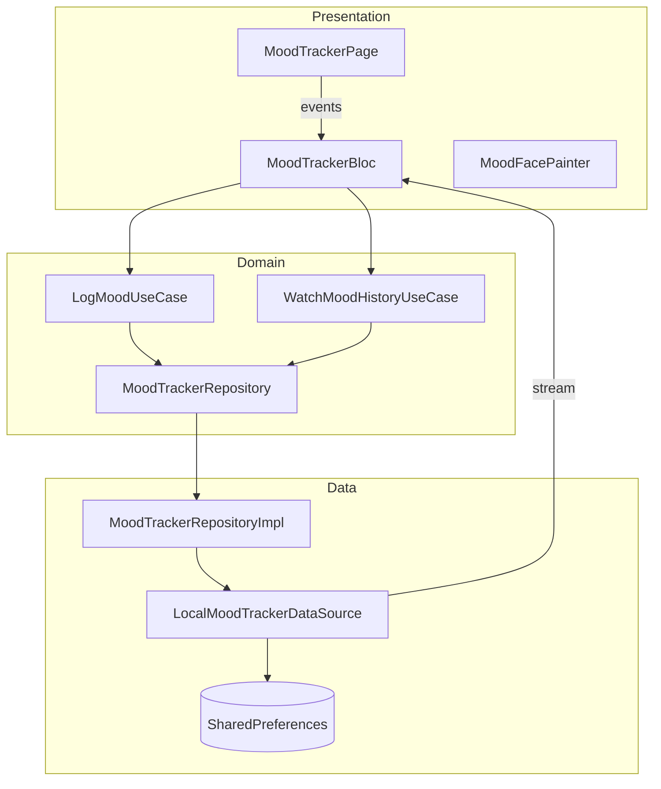

# Mood Canvas

A single-screen **Flutter web** mood tracker. Log how you feel with custom-drawn faces, review your last seven entries on an equal-width timeline, and tap any past entry for a quick pulse animation.

<p align="center">
  <a href="https://mood-canvas-demo-c6949.web.app"><strong>Live demo</strong></a>
  &nbsp;·&nbsp;
  <a href="https://www.loom.com/share/c3cd54bb171c407f9d576be77cae2863"><strong>Video walkthrough</strong></a>
  &nbsp;·&nbsp;
  <a href="https://github.com/alamin-karno/mood_canvas"><strong>Source code</strong></a>
</p>

---

## Demo

| | |
|---|---|
| **Live app** | [mood-canvas-demo-c6949.web.app](https://mood-canvas-demo-c6949.web.app) |
| **Code walkthrough** | [Loom — architecture, BLoC & CustomPainter](https://www.loom.com/share/c3cd54bb171c407f9d576be77cae2863) |
| **Repository** | [github.com/alamin-karno/mood_canvas](https://github.com/alamin-karno/mood_canvas) |

---

## Features

- **Three moods** — happy, neutral, and sad, each drawn with `CustomPainter` (`drawCircle`, `drawArc`, `drawPath`) — no images, emoji, or icon fonts
- **One-tap logging** — tap a face to save; selection highlight and success feedback via SnackBar
- **Seven-entry timeline** — horizontal row of recent moods with date, face, and color accent; tiles share width equally across the screen
- **Tap to replay** — tap a timeline entry for scale + accent glow animation
- **Offline-first** — entries stored locally with `shared_preferences` (no backend)
- **Material 3** — responsive layout for mobile, tablet, and web

---

## Tech stack

| Layer | Tools |
|-------|--------|
| UI | Flutter, Material 3 |
| State | `flutter_bloc`, `equatable` |
| Architecture | Clean architecture (feature-first) |
| DI | `get_it` |
| Functional errors | `fpdart` (`Either<Failure, T>`) |
| Persistence | `shared_preferences` |
| Hosting | Firebase Hosting |
| Tests | `flutter_test`, `bloc_test`, `mocktail` |

---

## Architecture

Feature-first clean architecture: **presentation → domain → data**.



**State flow**

1. `MoodTrackerStarted` — BLoC subscribes to `WatchMoodHistoryUseCase` and receives history updates from storage.
2. `MoodTrackerLogRequested` — `LogMoodUseCase` persists a new entry; the stream pushes the updated list (max **7** entries, newest first).
3. UI rebuilds from BLoC state — the page does not mutate the list directly.

Dependencies are wired in [`lib/injection.dart`](lib/injection.dart).

---

## Project structure

```
lib/
├── main.dart                 # Entry: path URL strategy, DI, runApp
├── injection.dart            # get_it registrations
└── src/
    ├── app.dart              # MaterialApp + MoodTrackerPage
    ├── core/                 # Config, errors, theme tokens
    ├── features/mood_tracker/
    │   ├── domain/           # Entities, repository, use cases
    │   ├── data/             # Local datasource, models, repo impl
    │   └── presentation/     # BLoC, page, widgets, MoodFacePainter
    └── services/             # StorageService wrapper
```

---

## Getting started

**Requirements:** Flutter SDK `>=3.5.0`

```bash
git clone https://github.com/alamin-karno/mood_canvas.git
cd mood_canvas
flutter pub get
flutter run -d chrome
```

---

## Tests

```bash
flutter test
flutter analyze
```

Coverage includes BLoC behavior, local storage cap (7 entries), `CustomPainter` smoke tests, and timeline widgets.

---

## Build & deploy

**Web release build**

```bash
flutter build web --release
```

**Firebase Hosting**

1. Install the [Firebase CLI](https://firebase.google.com/docs/cli) and sign in: `firebase login`
2. Copy `.firebaserc.example` to `.firebaserc` and set your project id
3. Build and deploy:

```bash
flutter build web --release
firebase deploy --only hosting
```

Hosting config serves `build/web` with SPA rewrites ([`firebase.json`](firebase.json)).

---

## Custom faces

Mood expressions live in [`mood_face_painter.dart`](lib/src/features/mood_tracker/presentation/painters/mood_face_painter.dart):

- **Happy** — arched brows, smile arc, cheek blush (`drawPath`)
- **Neutral** — flat brows and mouth line
- **Sad** — downturned brows and mouth, tear droplets (`drawPath`), heavier lids

`MoodFaceAvatar` wraps `CustomPaint` and handles selection scale animation.

---

## License

This project is provided as-is for portfolio and learning purposes.
